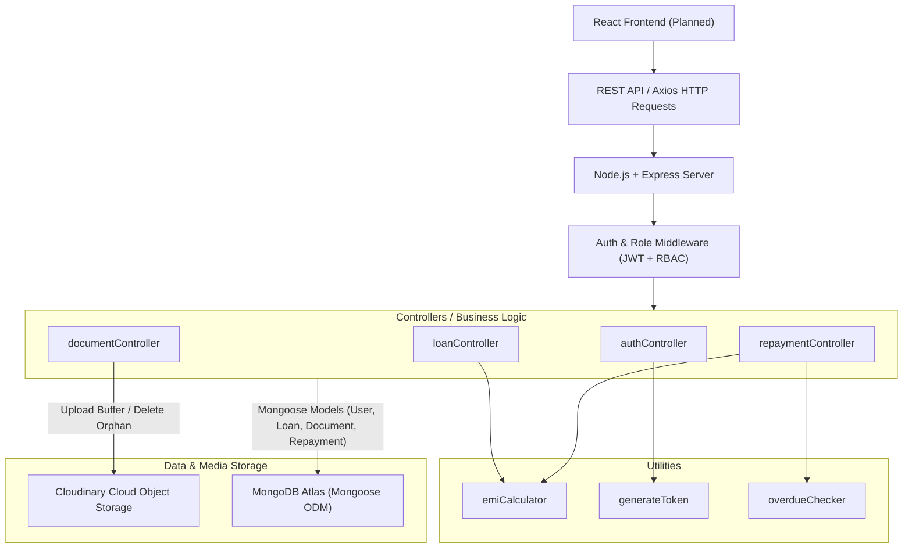
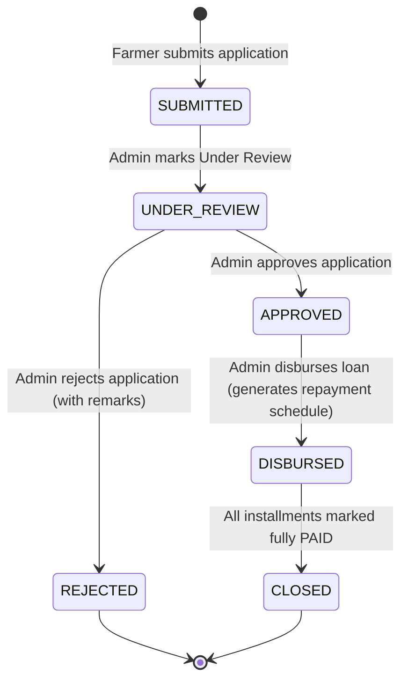

# FPO Loan Application and Repayment Tracking System

> A secure, role-based backend system designed for Farmer Producer Organizations (FPOs) to digitize agricultural loan applications, credit evaluations, supporting document verifications, automated EMI scheduling, and repayment tracking.


---

## 📌 Overview

A **Farmer Producer Organization (FPO)** is an institutional collective of primary producers (farmers) formed to enhance agricultural productivity, collective bargaining, and access to financial resources. Traditional loan handling in FPOs relies heavily on manual paper-based workflows, physical ledger books, and informal record-keeping. This traditional approach introduces critical operational challenges:

- Slow processing times for seasonal credit applications.
- Missing or misplaced physical land and KYC documentation.
- Absence of real-time visibility for farmers regarding loan approval stages.
- Calculation inaccuracies in repayment schedules, interest computations, and partial payments.
- Lack of centralized audit trails and overdue tracking.

The **FPO Loan Application and Repayment Tracking System** digitizes and automates this end-to-end operational cycle. It provides dedicated access controls for **FARMER** members and **FPO_ADMIN** administrators, establishing a transparent, auditable, and automated financial pipeline for agricultural lending.

---

## 🎯 Objectives

The primary objectives implemented in the backend architecture include:

- **Digital Loan Application**: Enable verified farmer members to apply for agricultural credit with structured parameters (amount, purpose, tenure, interest rate).
- **Supporting Document Management**: Secure handling of KYC, land records, and bank statements via cloud object storage.
- **Controlled Multi-Stage Review**: A deterministic state machine preventing illegal workflow jumps during loan review, approval, and rejection.
- **Loan Disbursement**: Dedicated authorization for administrators to record fund disbursement.
- **Automated EMI Calculation**: Precise mathematical computation supporting both standard interest-bearing loans and zero-interest initiatives.
- **Repayment Schedule Generation**: Automatic creation of installment schedules upon disbursement with individual due dates and status indicators.
- **Overdue Monitoring**: System-level checking that automatically flags unpaid past-due installments.
- **Role-Based Security & IDOR Prevention**: Granular data protection ensuring strict isolation between different farmer accounts.

---

## ✨ Key Features

### 👨‍🌾 Farmer Module
- **Self-Registration & Authentication**: Sign up as an active farmer member and authenticate securely via JSON Web Tokens.
- **Loan Application Submission**: Submit agricultural loan requests with custom amounts, tenure durations, and agricultural purpose.
- **Loan Portfolio Dashboard**: View all submitted, under-review, approved, active, and closed loans associated with the logged-in farmer.
- **Document Upload**: Upload essential verification files (Identity Proof, Address Proof, Land 7/12 Records, FPO Membership, Bank Statements) directly to Cloudinary.
- **Repayment Tracking**: Monitor individual installments, payment statuses (`PENDING`, `PARTIAL`, `PAID`, `OVERDUE`), amounts paid, and upcoming due dates.
- **Strict Data Isolation (IDOR Protection)**: Farmers cannot view, upload to, or access another farmer's loans, documents, or repayments.

### 👨💼 FPO Admin Module
- **Protected Administrator Authentication**: Admin accounts require a secure pre-configured `ADMIN_SECRET_KEY` during registration to prevent public privilege escalation.
- **Application Queue & Filtering**: Review all loan applications across the organization with status-based filtering (`SUBMITTED`, `UNDER_REVIEW`, `APPROVED`, `REJECTED`, `DISBURSED`, `CLOSED`).
- **Application Evaluation**: Transition applications from `SUBMITTED` into `UNDER_REVIEW`, followed by `APPROVED` or `REJECTED` (with mandatory rejection remarks).
- **Disbursement Recording**: Disburse approved loans, automatically triggering repayment installment generation.
- **Document Verification**: Review uploaded farmer documents with dedicated actions to mark them `VERIFIED` or `REJECTED` (with recorded rejection reasons and timestamps).
- **Payment Recording**: Record offline, bank transfer, or UPI installment receipts with partial payment support, accumulated payment totals, and transaction reference numbers.

### 💰 Loan Management
The backend enforces a strict, deterministic state machine for loan lifecycles:

```
SUBMITTED ──► UNDER_REVIEW ──┬──► APPROVED ──► DISBURSED ──► CLOSED
                             │
                             └──► REJECTED
```

- Unauthorized state bypasses (e.g., attempting to disburse a `SUBMITTED` or `REJECTED` loan) are rejected with HTTP 400.
- State changes store administrative audit trails (`approvedBy`, timestamps, `remarks`).

### 📄 Document Management
- **In-Memory Streaming**: File uploads use Multer with `memoryStorage()`, streaming buffers directly to Cloudinary without writing temporary files to local disk.
- **Supported Formats**: Whitelisted file types include PDF (`application/pdf`), JPEG/JPG (`image/jpeg`), and PNG (`image/png`).
- **Size Boundary**: Strict enforcement of a 5 MB maximum file limit.
- **Automatic Orphan Cleanup**: If a database error occurs after a file is successfully uploaded to Cloudinary, the system automatically removes the orphaned cloud asset via the Cloudinary Admin API (`uploader.destroy()`).
- **Verification Audit**: Maintains reviewer identity (`verifiedBy`) and timestamp (`verifiedAt`).

### 💳 EMI & Repayment
- **Automated Installment Schedule**: Disbursing a loan dynamically calculates the monthly installment and inserts $n$ repayment documents corresponding to the tenure.
- **Partial Payment Allocation**: Supports progressive partial repayments, tracking `amountPaid` and shifting status between `PENDING`, `PARTIAL`, and `PAID`.
- **Payment Immutability**: Fully paid installments cannot be tampered with or overpaid.
- **Overdue Detection**: Automated query flags overdue installments when `dueDate < current_date` and status is still `PENDING` or `PARTIAL`.
- **Automated Loan Closure**: Once all installment obligations are fully marked `PAID`, the parent loan automatically transitions to `CLOSED`.

---

## 🏗️ System Architecture



---

## 🧰 Technology Stack

| Layer | Technology | Purpose |
| :--- | :--- | :--- |
| **Runtime Environment** | Node.js (v18+) | Server-side JavaScript runtime engine |
| **Web Framework** | Express.js (v5.x) | RESTful routing, middleware orchestration, and HTTP request pipeline |
| **Database** | MongoDB Atlas | Cloud-hosted NoSQL document database |
| **Object Data Modeling** | Mongoose (v9.x) | Schema validation, type casting, population, and query building |
| **Authentication** | JSON Web Tokens (`jsonwebtoken` v9.x) | Stateless, signed bearer token authorization |
| **Password Security** | `bcryptjs` (v3.x) | Salt generation and cryptographic password hashing (10 rounds) |
| **File Handling** | Multer (v2.x) | Multipart/form-data middleware using memory storage buffers |
| **Cloud Media Storage** | Cloudinary SDK (v2.x) | Secure cloud upload streaming and asset lifecycle management |
| **CORS Middleware** | `cors` (v2.8.x) | Cross-Origin Resource Sharing enablement for client communication |
| **Configuration** | `dotenv` (v17.x) | Environment variable management |
| **Development** | Nodemon (v3.x) | Automated development server reloading |
| **Testing Environment** | `mongodb-memory-server` (v11.x) | Isolated in-memory MongoDB engine for rapid, zero-side-effect test suites |

---

## 📁 Project Structure

```
fpo-loan-system/
├── backend/
│   ├── config/
│   │   ├── cloudinary.js          # Cloudinary SDK config, upload stream, and asset cleanup
│   │   └── db.js                  # Mongoose MongoDB Atlas connection handler
│   ├── controllers/
│   │   ├── authController.js      # User registration, login, profile, and admin key check
│   │   ├── documentController.js  # File upload, verification, rejection, and ownership
│   │   ├── loanController.js      # Loan application submission, review, approval, disbursement
│   │   └── repaymentController.js # Schedule queries, partial/full payment, and loan closure
│   ├── middleware/
│   │   ├── authMiddleware.js      # Bearer token verification and req.user attachment
│   │   ├── roleMiddleware.js      # Role-Based Access Control (FARMER / FPO_ADMIN)
│   │   └── uploadMiddleware.js    # Multer configuration, 5MB limit, and mime filter
│   ├── models/
│   │   ├── Document.js            # Document metadata schema and Cloudinary URL references
│   │   ├── Loan.js                # Loan core schema, financial parameters, and status enums
│   │   ├── Repayment.js           # Installment schedule, payment tracking, and methods
│   │   ├── User.js                # User identity, hashed passwords, roles, and FPO info
│   │   └── index.js               # Central barrel export for all Mongoose models
│   ├── routes/
│   │   ├── authRoutes.js          # Authentication and profile endpoints
│   │   ├── documentRoutes.js      # Upload, view, verify, and reject document endpoints
│   │   ├── loanRoutes.js          # Loan submission, query, review, and disbursement endpoints
│   │   └── repaymentRoutes.js     # Repayment retrieval and installment payment endpoints
│   ├── utils/
│   │   ├── emiCalculator.js       # Mathematical reducing-balance & zero-interest EMI utility
│   │   ├── generateToken.js       # JWT signing utility with expiration handling
│   │   └── overdueChecker.js      # Automated query utility flagging past-due installments
│   ├── server.js                  # Express app initialization, route mounting, and health route
│   ├── package.json               # Dependencies, project metadata, and npm scripts
│   ├── package-lock.json          # Deterministic dependency lockfile
│   ├── .gitignore                 # Exclusion rules (node_modules, .env, *.log)
│   ├── verify.js                  # Phase 1 Mongoose schema & Atlas connection test
│   ├── verify_phase2.js           # Phase 2 Auth & RBAC verification test suite
│   ├── verify_phase3.js           # Phase 3 Loan Management lifecycle test suite
│   ├── verify_phase4.js           # Phase 4 Document upload & verification test suite
│   ├── verify_phase5.js           # Phase 5 EMI calculation & Repayment test suite
│   └── verify_cloudinary.js       # Live Cloudinary SDK upload and retrieval test suite
└── README.md
```

---

## 🔐 Security Architecture

- **Cryptographic Password Hashing**: Passwords are never stored in plain text. Hashing is executed via `bcryptjs` with 10 salt rounds. The field is configured with `select: false` at the schema level to prevent leakage in database queries.
- **Stateless JWT Authorization**: API requests are authenticated using signed JSON Web Tokens carrying `{ id, role }`. Expired tokens (`TokenExpiredError`) and malformed tokens return HTTP 401.
- **Role-Based Access Control (RBAC)**: Route-level middleware enforces role segregation (`FARMER` vs. `FPO_ADMIN`), rejecting unauthorized role actions with HTTP 403.
- **Admin Privilege Protection**: Registration as `FPO_ADMIN` strictly requires matching the `ADMIN_SECRET_KEY` configured in the backend environment. Public self-assignment of admin privileges is blocked.
- **Insecure Direct Object Reference (IDOR) Defense**:
  - Farmers cannot access or modify loans belonging to other farmers.
  - Farmers cannot upload documents to loans they do not own.
  - Farmers cannot inspect repayments belonging to other farmers.
- **Input & ID Validation**: All incoming route parameters are validated using `mongoose.Types.ObjectId.isValid()`. Malformed IDs immediately return HTTP 400.
- **Strict File Upload Validation**: Multer enforces both an extension and MIME-type whitelist (`application/pdf`, `image/jpeg`, `image/png`) and a strict 5 MB payload ceiling before Cloudinary is reached.
- **Credential Protection**: Database connection strings, JWT signing keys, and Cloudinary API credentials reside exclusively in environment variables and are excluded via `.gitignore`.

---

## 🔌 REST API Documentation

### 1. Health Endpoint
| Method | Endpoint | Authentication | Role | Description |
| :--- | :--- | :---: | :---: | :--- |
| `GET` | `/api/health` | Public | Any | Returns API operational status, environment, and loaded models |

### 2. Authentication Module
| Method | Endpoint | Authentication | Role | Description |
| :--- | :--- | :---: | :---: | :--- |
| `POST` | `/api/auth/register` | Public | Any | Register a new user (`FARMER` default, `FPO_ADMIN` requires `adminSecretKey`) |
| `POST` | `/api/auth/login` | Public | Any | Authenticate user and issue JWT bearer token |
| `GET` | `/api/auth/me` | Bearer Token | `FARMER`, `FPO_ADMIN` | Retrieve currently authenticated user profile |

### 3. Loan Management Module
| Method | Endpoint | Authentication | Role | Description |
| :--- | :--- | :---: | :---: | :--- |
| `POST` | `/api/loans` | Bearer Token | `FARMER` | Submit a new loan application (auto-associated with farmer) |
| `GET` | `/api/loans/my` | Bearer Token | `FARMER` | Retrieve all loan applications belonging to the logged-in farmer |
| `GET` | `/api/loans` | Bearer Token | `FPO_ADMIN` | List all loans across the organization with optional `status` filter |
| `GET` | `/api/loans/:id` | Bearer Token | `FARMER`, `FPO_ADMIN` | Retrieve loan details (farmers restricted to their own loans) |
| `PUT` | `/api/loans/:id/under-review` | Bearer Token | `FPO_ADMIN` | Transition loan status from `SUBMITTED` to `UNDER_REVIEW` |
| `PUT` | `/api/loans/:id/approve` | Bearer Token | `FPO_ADMIN` | Approve loan from `UNDER_REVIEW`; records `approvedBy` |
| `PUT` | `/api/loans/:id/reject` | Bearer Token | `FPO_ADMIN` | Reject loan from `UNDER_REVIEW`; requires `remarks` |
| `PUT` | `/api/loans/:id/disburse` | Bearer Token | `FPO_ADMIN` | Disburse approved loan and auto-generate repayment schedule |

### 4. Document Management Module
| Method | Endpoint | Authentication | Role | Description |
| :--- | :--- | :---: | :---: | :--- |
| `POST` | `/api/documents/upload` | Bearer Token | `FARMER` | Upload supporting document to Cloudinary for a farmer's loan (multipart/form-data) |
| `GET` | `/api/documents/my` | Bearer Token | `FARMER` | Retrieve all documents uploaded by the authenticated farmer |
| `GET` | `/api/documents/loan/:loanId` | Bearer Token | `FARMER`, `FPO_ADMIN` | Retrieve documents for a specific loan (ownership enforced) |
| `GET` | `/api/documents` | Bearer Token | `FPO_ADMIN` | Retrieve all uploaded documents across all loans |
| `PUT` | `/api/documents/:id/verify` | Bearer Token | `FPO_ADMIN` | Mark document status as `VERIFIED` with timestamp |
| `PUT` | `/api/documents/:id/reject` | Bearer Token | `FPO_ADMIN` | Reject document; requires `rejectionReason` in body |

### 5. Repayment Management Module
| Method | Endpoint | Authentication | Role | Description |
| :--- | :--- | :---: | :---: | :--- |
| `GET` | `/api/repayments/my` | Bearer Token | `FARMER` | Retrieve all repayment installments for the logged-in farmer |
| `GET` | `/api/repayments/loan/:loanId` | Bearer Token | `FARMER`, `FPO_ADMIN` | Retrieve installments for a specific loan (ownership enforced) |
| `GET` | `/api/repayments` | Bearer Token | `FPO_ADMIN` | View all installments with optional `status`, `loan`, and `borrower` filters |
| `PUT` | `/api/repayments/:id/pay` | Bearer Token | `FPO_ADMIN` | Record installment payment (partial or full); auto-closes loan when complete |

---

## 🗄️ Database Design

```
 ┌────────────────┐          1:N          ┌────────────────┐
 │      User      │───────────────────────►      Loan      │
 │ (FARMER/ADMIN) │                        │                │
 └────────────────┘                        └────────────────┘
         │                                         │
         │ 1:N                             1:N     │
         ▼                                         ▼
 ┌────────────────┐                       ┌────────────────┐
 │    Document    │                       │   Repayment    │
 │ (Cloudinary)   │                       │ (Installments) │
 └────────────────┘                       └────────────────┘
```

### 1. `User` Schema
- `name` (String, required, trimmed)
- `email` (String, required, unique, lowercase)
- `password` (String, required, `select: false`)
- `phone` (String, required, trimmed)
- `role` (String, enum: `['FARMER', 'FPO_ADMIN']`, default: `'FARMER'`)
- `fpoName` (String, optional, for FPO affiliation)
- `fpoRegistrationNo` (String, optional)
- `address` (Subdocument: `street`, `village`, `district`, `state`, `pincode`)
- `kycVerified` (Boolean, default: `false`)
- `status` (String, enum: `['ACTIVE', 'INACTIVE', 'SUSPENDED']`)

### 2. `Loan` Schema
- `farmer` (ObjectId, ref: `'User'`, required)
- `approvedBy` (ObjectId, ref: `'User'`, populated upon approval)
- `loanAmount` (Number, required, min: 0)
- `purpose` (String, required, trimmed)
- `interestRate` (Number, default: 0, min: 0)
- `tenureMonths` (Number, required, min: 1)
- `status` (String, enum: `['SUBMITTED', 'UNDER_REVIEW', 'APPROVED', 'REJECTED', 'DISBURSED', 'CLOSED']`, default: `'SUBMITTED'`)
- `disbursedAmount` (Number, default: 0)
- `disbursedDate` (Date)
- `repaymentFrequency` (String, enum: `['MONTHLY', 'QUARTERLY', 'SEASONAL', 'BULLET']`, default: `'MONTHLY'`)
- `remarks` (String, trimmed)

### 3. `Document` Schema
- `loan` (ObjectId, ref: `'Loan'`, required)
- `user` (ObjectId, ref: `'User'`, required)
- `documentType` (String, enum: `['ID_PROOF', 'ADDRESS_PROOF', 'LAND_RECORD', 'FPO_MEMBERSHIP', 'BANK_STATEMENT', 'FINANCIAL_REPORT', 'OTHER']`)
- `documentName` (String, required)
- `fileUrl` (String, required, Cloudinary HTTPS URL)
- `fileType` (String, MIME type)
- `status` (String, enum: `['PENDING', 'VERIFIED', 'REJECTED']`, default: `'PENDING'`)
- `uploadedAt` (Date, default: `Date.now`)
- `verifiedAt` (Date)
- `verifiedBy` (ObjectId, ref: `'User'`)
- `rejectionReason` (String)

### 4. `Repayment` Schema
- `loan` (ObjectId, ref: `'Loan'`, required)
- `borrower` (ObjectId, ref: `'User'`, required)
- `installmentNumber` (Number, required, min: 1)
- `amountDue` (Number, required, min: 0)
- `amountPaid` (Number, default: 0, min: 0)
- `dueDate` (Date, required)
- `paidDate` (Date)
- `paymentStatus` (String, enum: `['PENDING', 'PARTIAL', 'PAID', 'OVERDUE']`, default: `'PENDING'`)
- `paymentMethod` (String, enum: `['BANK_TRANSFER', 'UPI', 'CASH', 'CHEQUE', 'OTHER']`)
- `transactionReference` (String, trimmed)
- `remarks` (String, trimmed)

---

## 💵 EMI Calculation

The backend implements a standalone mathematical calculator in [`backend/utils/emiCalculator.js`](file:///Users/sudhir31/Documents/VSCode/Projects/fpo-loan-system/backend/utils/emiCalculator.js).

### Standard Reducing-Balance Formula
For loans with an annual interest rate ($R > 0$):

$$EMI = \frac{P \times r \times (1 + r)^n}{(1 + r)^n - 1}$$

Where:
- $P$ = Principal disbursed loan amount
- $r$ = Monthly interest rate $= \frac{\text{annualInterestRate}}{12 \times 100}$
- $n$ = Loan tenure in months

### Zero-Interest Handling
To support agricultural welfare initiatives and government-subsidized credit, the calculator explicitly handles zero-interest loans ($R = 0$):

$$EMI = \frac{P}{n}$$

All outputs are defensively checked against invalid inputs ($\le 0$) and rounded to exactly 2 decimal places using `Math.round((value) * 100) / 100`.

---

## ☁️ Cloudinary Integration

Document storage is handled using the official Cloudinary SDK v2:

1. **Multer In-Memory Buffer**: Files are accepted through Express routes via `multer({ storage: multer.memoryStorage(), limits: { fileSize: 5 * 1024 * 1024 } })`.
2. **Buffer Streaming**: The memory buffer is streamed into `cloudinary.uploader.upload_stream` targeting the dedicated cloud folder `fpo_loan_documents`.
3. **Asset Persistence**: The returned `secure_url` (HTTPS) is stored in the `Document.fileUrl` field in MongoDB.
4. **Failure Safeguard**: If the subsequent MongoDB document creation fails, the controller invokes `cloudinary.uploader.destroy()` to remove the uploaded file from Cloudinary, preventing orphan storage bloat.

---

## 🧪 Testing & Validation

The entire backend has undergone extensive automated verification across all 5 implementation phases and live Cloudinary integration:

| Component | Test Suite | Assertions | Result |
| :--- | :--- | :---: | :---: |
| **Phase 1: Schemas & Database** | `verify.js` / `npm test` | 4 Models + Atlas Connection | **PASSED** |
| **Phase 2: Authentication & RBAC** | `verify_phase2.js` | 19 assertions | **19 / 19 PASSED** |
| **Phase 3: Loan Management** | `verify_phase3.js` | 16 assertions | **16 / 16 PASSED** |
| **Phase 4: Document Uploads** | `verify_phase4.js` | 18 assertions | **18 / 18 PASSED** |
| **Phase 5: Repayments & EMI** | `verify_phase5.js` | 26 assertions | **26 / 26 PASSED** |
| **Cloudinary Integration** | `verify_cloudinary.js` | 20 assertions | **20 / 20 PASSED** |

**Total automated assertions: 99/99 passed.**

> *Note: While the automated test suites thoroughly validate unit rules, RBAC enforcement, state machines, and end-to-end API flows, real-world deployments should include end-to-end integration and staging testing.*

---

## ⚙️ Installation & Setup

### Prerequisites
- [Node.js](https://nodejs.org/) (version 18 or higher recommended)
- [npm](https://www.npmjs.com/) (version 9 or higher)
- A [MongoDB Atlas](https://www.mongodb.com/atlas) cluster or local MongoDB instance
- A free [Cloudinary](https://cloudinary.com/) account for document uploads

### 1. Clone the Repository
```bash
git clone <repository-url>
cd fpo-loan-system
```

### 2. Install Dependencies
```bash
cd backend
npm install
```

### 3. Configure Environment Variables
Create a `.env` file in the `backend/` directory:

```env
PORT=5001
NODE_ENV=development
MONGO_URI=your_mongodb_connection_string
JWT_SECRET=your_jwt_secret_key
JWT_EXPIRE=1d
ADMIN_SECRET_KEY=your_admin_secret_key
CLOUDINARY_CLOUD_NAME=your_cloudinary_cloud_name
CLOUDINARY_API_KEY=your_cloudinary_api_key
CLOUDINARY_API_SECRET=your_cloudinary_api_secret
```

> ⚠️ **CRITICAL SECURITY NOTE**: Never commit `.env` to Git or expose database and Cloudinary credentials in public repositories. Keep `.env` included in `.gitignore`.

### 4. Run the Project
- **Start Production Server**:
  ```bash
  npm start
  ```
- **Start Development Server (with nodemon)**:
  ```bash
  npm run dev
  ```
- **Run Phase 1 Verification Test**:
  ```bash
  npm test
  ```
- **Run Individual Test Suites**:
  ```bash
  node verify_phase2.js
  node verify_phase3.js
  node verify_phase4.js
  node verify_phase5.js
  node verify_cloudinary.js
  ```

---

## 🔄 Loan Workflow State Machine



---

## 👥 Team Contributions

- **Sasthika D** — Farmer Module / React Frontend Planning & Specification
- **Rhidhanya K** — Admin Module / React Frontend Planning & Specification
- **Sudhir S** — Backend Architecture & Database Engineering
  - Complete Express.js REST API and application architecture.
  - MongoDB Atlas integration, indexing, and Mongoose schema modeling.
  - JWT authentication and Role-Based Access Control (`FARMER` / `FPO_ADMIN`).
  - Loan lifecycle state engine and business logic validation.
  - Reducing-balance and zero-interest EMI mathematical calculators.
  - Disbursed repayment schedule generation, partial/full payment tracking, and automated loan closure.
  - Multer in-memory file handling and real Cloudinary cloud storage integration.
  - IDOR security safeguards, input sanitization, and error handling.
  - Authoring and validating all automated test suites (Phases 1–5 + Cloudinary).

---

## 🚧 Current Project Status

### Backend
- ✅ **Fully Implemented & Operational**: Express server with all 4 functional controller domains.
- ✅ **MongoDB Atlas Connected**: All 4 Mongoose models operational with relational integrity.
- ✅ **Real Cloudinary Integration**: Active upload, retrieval, and orphan cleanup verified.
- ✅ **Authentication & RBAC**: JWT authorization and role segregation operational.
- ✅ **Loan Lifecycle & EMI**: Deterministic transitions and financial math verified.
- ✅ **Tested & Verified**: 99 out of 99 automated test assertions passing.

### Frontend
- ⏳ **In Progress / Planned Integration**: The current repository contains the backend codebase. The React frontend architecture and UI screens are designed and ready for integration against the finalized backend API contracts.

---

## 🔮 Future Enhancements

The following capabilities represent planned future additions to the system:

1. **Online Payment Gateway Integration**: Razorpay / UPI integration for direct digital repayment by farmers.
2. **Automated Notification Engine**: SMS (via Twilio/Fast2SMS) and WhatsApp alerts for loan status updates and upcoming EMI due dates.
3. **FPO Executive Dashboard Analytics**: Visual aggregation of loan portfolio health, total capital disbursed, default rates, and recovery ratios.
4. **Audit Logging & Activity Trails**: Dedicated log stream capturing admin actions for regulatory compliance.
5. **Containerization & Production Deployment**: Dockerization and automated CI/CD deployment pipelines on managed cloud infrastructure.

---

## 📄 License

This project was developed for academic and institutional evaluation. Licensing terms can be applied based on future deployment and distribution requirements.
